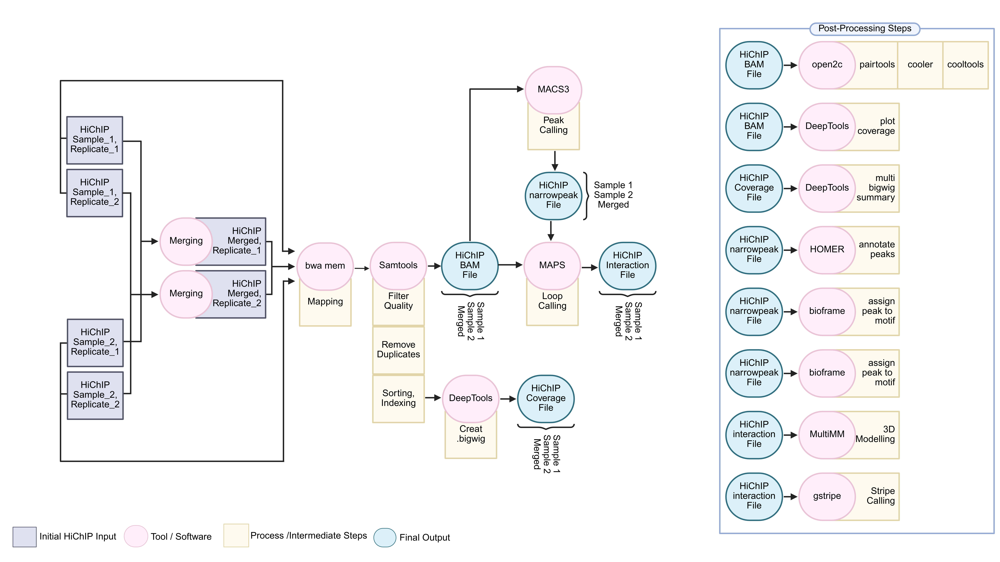

# 🔍 3 Working Cases

dcHiChIP supports three primary use cases, designed to accommodate the most common experimental scenarios involving HiChIP and ChIP-seq data.

---

## 🧬 Case 1: HiChIP FASTQ Only

This mode processes raw HiChIP paired-end FASTQ files and performs end-to-end analysis, including alignment, peak calling, loop detection, and 3D modeling.

---

## 🧬 Case 2: HiChIP FASTQ + Pre-Processed ChIP-Seq Peaks

In this mode, the user provides raw HiChIP FASTQ files along with pre-processed ChIP-seq peaks in **narrowPeak** format. This bypasses the need for peak calling from HiChIP reads.

---

## 🧬 Case 3: HiChIP FASTQ + ChIP-Seq FASTQ

This configuration performs joint processing of both HiChIP and ChIP-seq FASTQ files. ChIP-seq reads are aligned, and peaks are called independently to guide HiChIP loop detection.

---

Each case is automatically detected and managed by the pipeline based on input parameters and file formats provided in the configuration file.

